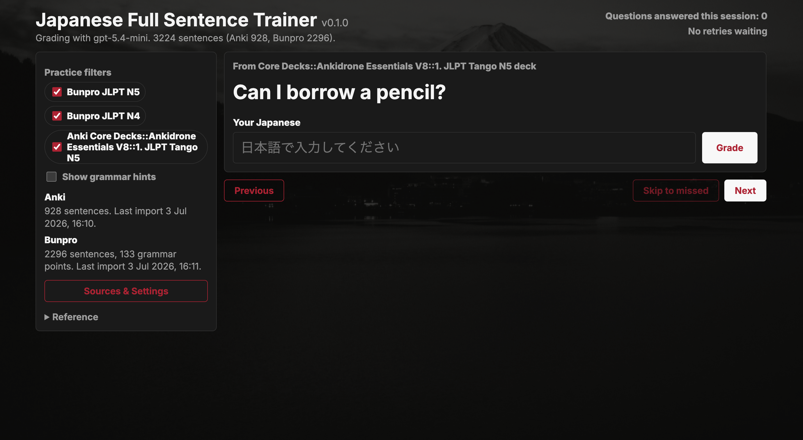
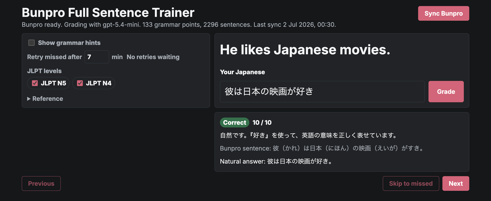
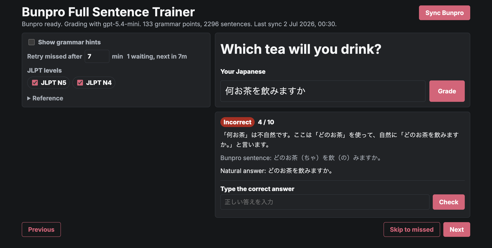
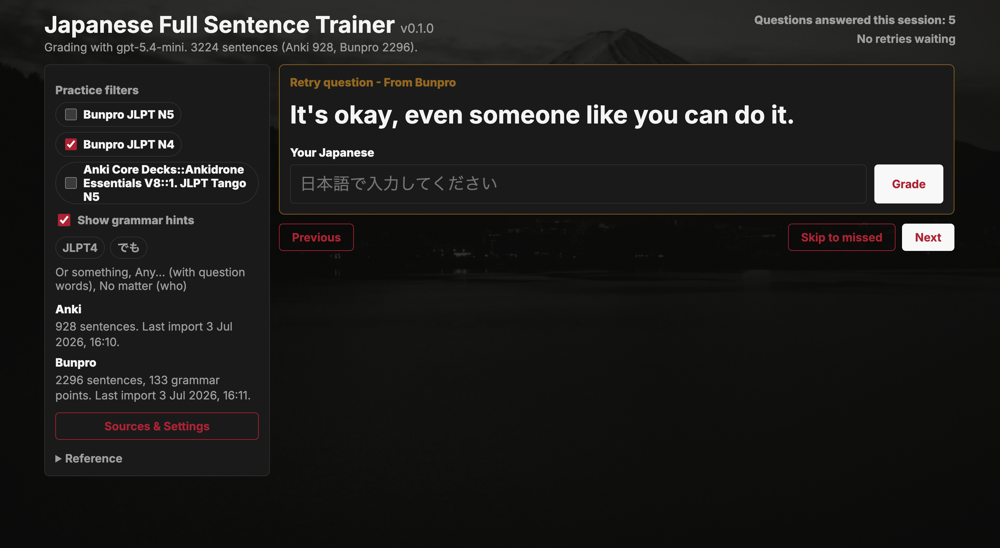
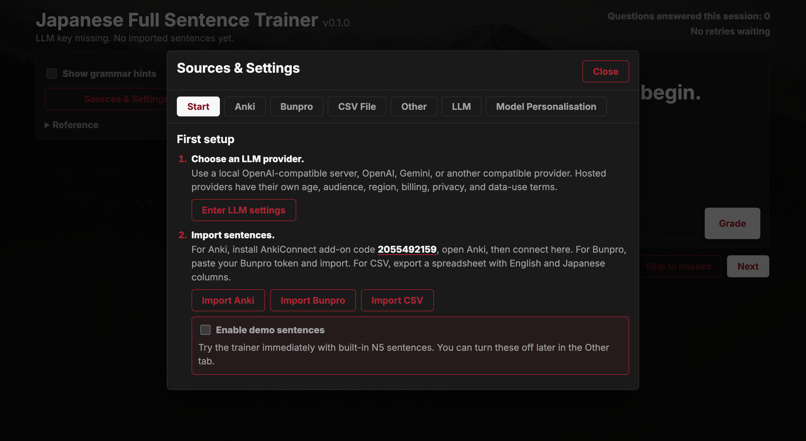
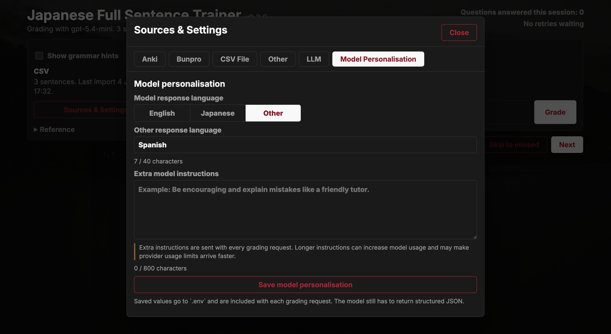

# Japanese Full Sentence Trainer

A local practice app for full-sentence Japanese translation practice.

It shows you an English sentence, asks you to type the Japanese, and uses an LLM to grade whether your answer is correct, close, or incorrect. You can import sentences from Anki, Bunpro, or CSV files, or turn on built-in demo sentences for a quick trial.

The app runs on your own computer. You do not need Node.js, npm, Git, or a terminal if you download a packaged release.

## Screenshots













## Quick Start

1. Open the GitHub [**Releases**](https://github.com/h7-v/japanese-full-sentence-trainer/releases) page for this project.
2. Download the release ZIP for your computer.
3. Unzip it.
4. Keep the files together in the same folder.
5. Start the app:
   - Windows: double-click **Start Japanese Full Sentence Trainer.cmd**.
   - macOS/Linux: double-click **Japanese Full Sentence Trainer**.
6. Your browser should open automatically.
7. Click **Start setup** if the setup window is not already open.

On Windows, use the `.cmd` launcher instead of double-clicking the `.exe` directly. If startup fails, the launcher keeps the window open and shows the error.

## What You Need

Most users need only two things:

- An LLM API key so the app can grade answers.
- Sentences to practice with.

Choose an LLM provider that fits your situation:

- **Local OpenAI-compatible server**: the most private option, because grading can stay on your computer. Model quality and setup vary.
- **OpenAI API**: hosted, paid API usage. ChatGPT Plus/Pro does not include OpenAI API credit.
- **Gemini API**: supported, including Gemini's OpenAI-compatible endpoint, but check Google's current Gemini API terms before using it.

This project is not legal advice. Hosted LLM providers have their own terms for age, audience, billing, region, privacy, and data use. Do not assume a free or unpaid API quota is suitable for every user or use case.

You can get practice sentences from any of these:

- **Demo sentences**: built in, useful for a quick test.
- **Anki**: import cards from one of your Anki decks.
- **Bunpro**: import example sentences for your studied grammar points.
- **CSV File**: import a spreadsheet you exported as CSV.

## Where To Get Keys And Tokens

- Local OpenAI-compatible server: follow your local server's instructions. Some local servers accept a dummy API key.
- OpenAI API key, if you prefer OpenAI: [platform.openai.com/api-keys](https://platform.openai.com/api-keys)
- Gemini API key, if you choose Gemini: [aistudio.google.com/apikey](https://aistudio.google.com/apikey)
- Bunpro token: use the instructions in the app's **Bunpro** tab, or see **Detailed Bunpro Token Instructions** below.

Keep API keys and tokens private. The app saves them to `.env` in the app folder.

## First Setup

When the app opens, use **Sources & Settings**.

### 1. Add Your LLM Key

Open the **LLM** tab.

If you use a local LLM, enter your local OpenAI-compatible base URL and model:

```text
LLM base URL: http://localhost:11434/v1
LLM model: your_local_model_name
```

Local model quality varies. The model needs to understand English and Japanese, follow grading instructions, and return valid JSON.

If you prefer OpenAI, use:

```text
LLM base URL: https://api.openai.com/v1
LLM model: gpt-5.4-mini
```

OpenAI API usage is billed separately from ChatGPT Plus/Pro. As of July 2026, about 5 USD of OpenAI API credit should grade roughly 1,500 questions with `gpt-5.4-mini`, depending on sentence length, response length, and current model prices. Check the current [OpenAI API pricing](https://platform.openai.com/docs/pricing) before relying on this estimate.

If you choose Gemini, the app can use Gemini's OpenAI-compatible endpoint:

```text
LLM base URL: https://generativelanguage.googleapis.com/v1beta/openai
LLM model: gemini-3.5-flash
```

Gemini may offer unpaid quota, but Google has specific Gemini API terms covering age, audience, region, billing, and data use. Check the current [Gemini API Additional Terms](https://ai.google.dev/gemini-api/terms) and [Gemini API billing documentation](https://ai.google.dev/gemini-api/docs/billing) before using it.

Paste your provider key into **LLM API key**, then click **Save LLM settings**.

To choose whether grading feedback is written in English, Japanese, or another language, open **Model Personalisation** and change **Model response language**.

### Provider Terms Note

Before using a hosted LLM provider, check that your use complies with that provider's current terms.

For Gemini specifically, Google's current Gemini API terms say the API is for developers building with Google AI models for professional or business purposes, not consumer use; users must be 18 or older; and API clients must not be directed toward or likely to be accessed by under-18s. The terms also include region, paid-service, unpaid-quota, and data-use requirements.

If you use Gemini, you are responsible for checking whether free/unpaid quota, paid billing, or Gemini at all is appropriate for your use case and region. A local OpenAI-compatible model is the best option if you want grading without sending prompts and answers to a hosted LLM provider.

### 2. Try Demo Sentences

For a quick test, enable demo sentences.

You can turn them on from:

- the **Start** tab during first setup
- the **Other** tab later

Demo sentences give you ten simple N5-level sentences without importing from Anki, Bunpro, or CSV. You still need an LLM key to grade your answers.

### 3. Import Your Own Sentences

You only need one source, but you can use several together.

**Anki**

1. Install Anki desktop from [apps.ankiweb.net](https://apps.ankiweb.net/).
2. Install AnkiConnect add-on code [2055492159](https://ankiweb.net/shared/info/2055492159).
3. Restart Anki.
4. Keep Anki open.
5. In this app, open **Sources & Settings** -> **Anki**.
6. Click **Connect Anki**.
7. Choose a deck.
8. Choose the English field and Japanese field.
9. Optionally choose a grammar hint field.
10. Preview, then import.

The app only reads from Anki. It does not edit your cards.

**Bunpro**

1. Get your Bunpro frontend token using the instructions in the **Bunpro** tab.
2. Paste it into **Sources & Settings** -> **Bunpro**.
3. Click **Save Bunpro token**.
4. Click **Import Bunpro**.

The Bunpro importer uses an unofficial Bunpro frontend API. Bunpro can change it at any time.

**CSV File**

Use a CSV exported from Excel, Google Sheets, or another spreadsheet app.

Your CSV should have a header row and at least two columns:

```csv
English,Japanese,Hint
The sea is beautiful.,海が綺麗だ,い-adjective / な-adjective practice
I went to Tokyo yesterday.,昨日東京に行きました,Past tense
```

Then open **Sources & Settings** -> **CSV File**, choose the file, select the English/Japanese/hint columns, preview, and import.

CSV imports are capped at 5,000 rows and 2 MB. Very long fields are shortened before saving.

## Using The App

- Type your Japanese answer and press Enter to grade.
- If your answer is correct, press Enter again to move to the next question.
- Incorrect answers can be retried after the delay set in **Other**.
- Use **Practice filters** to choose which Bunpro levels, Anki decks, CSV files, or demo sentences appear.
- Enable **Show grammar hints** if you want Bunpro grammar points or imported hint fields shown.
- Open **Model Personalisation** to choose the feedback language and add optional response instructions.

The app keeps a count of questions answered this session. Pressing Next without grading does not increase the count.

## Files In The Release Folder

- `.env.example` shows supported settings.
- `.env` is created when you save keys/settings in the browser UI.
- `cache/` stores local Bunpro, Anki, and CSV imports, plus `cache/stats.json` for lifetime stats.
- `updates/` stores downloaded updates and backup folders made during automatic updates.
- `public/` contains the browser UI and images.
- `startup-error.log` appears if the app crashes during startup.

Do not share `.env`. It contains private API keys and tokens.

Cache files include a cache schema version and the app version that wrote them. Older cache files without this metadata are treated as cache schema version 1 from app version 0.2.2.

To reset lifetime stats, close the app and delete `cache/stats.json`.

To stop the packaged app, close the command/terminal window that opened with it.

## Updating The App

Packaged releases check GitHub for newer releases when the app starts. If an update is available, the app shows an update banner.

Click **Install update** to download the matching release ZIP for your computer. The app then closes, runs the included updater, replaces the app files, and restarts.

Automatic updates preserve:

- `.env`
- `cache/`
- `updates/`

The updater also creates a backup folder under `updates/` before replacing files. If something goes wrong, check `update-error.log` or the backup folder in `updates/`.

If you run the app from source, automatic install is disabled. Update with Git instead.

## Detailed Bunpro Token Instructions

Bunpro does not currently document this frontend API for third-party apps, so this part is more awkward than the rest.

1. Log in to [bunpro.jp/dashboard](https://bunpro.jp/dashboard).
2. Open your browser developer tools.
   - Chrome or Edge: right click the page, click **Inspect**, then click the **Network** tab.
   - Firefox: right click the page, click **Inspect**, then click the **Network** tab.
3. Refresh Bunpro while the Network tab is open.
4. Search for `user`.
5. Click a request such as `user`, `queue`, `due`, or `srs_level_overview`. On Chrome, the type is usually `fetch`.
6. Open the **Headers** tab for that request.
7. Scroll to **Request Headers**.
8. Find the `authorization` header. It looks like this:

```text
Token token=your_bunpro_token_here
```

Copy only the part after `token=`.

Example:

```text
Token token=abc123
```

The Bunpro token value is:

```text
abc123
```

Treat this token like a password. Bunpro warns that this token can give third-party apps read and write access to your Bunpro data. This app only uses read-oriented endpoints, but the token itself is still sensitive.

## Privacy

This app runs locally on your computer. Bunpro, AnkiConnect, CSV parsing, and LLM grading requests are handled by the local app server.

The browser setup form sends keys to the local app server so it can write `.env`. It does not store secret values in local storage or show saved secret values again.

A browser extension with permission to read all page content may still see values while you type them. If that worries you, edit `.env` manually instead of typing keys into the browser page.

When you grade an answer with a hosted LLM provider, the app sends the English prompt, your Japanese answer, the reference answer, any hint/context, and your model personalisation instructions to that provider. Local LLM providers avoid this hosted-provider data transfer, assuming your local server is actually running on your own machine.

If you use Gemini unpaid quota, Google's terms describe additional data-use rules for Unpaid Services, including possible human review outside the UK/EEA/Switzerland data-use carve-out. Check Google's current terms before sending anything sensitive, confidential, or personal.

Do not share:

- `.env`
- your Bunpro token
- your Gemini/OpenAI/local LLM API key
- `cache/bunpro-sync.json`, if you consider your studied grammar data private
- `cache/anki-deck-*.json`, if you consider your imported Anki sentences private
- `cache/csv-file-*.json`, if you consider your imported CSV sentences private
- `cache/stats.json`, if you consider your practice totals private

## Troubleshooting

### The App Opens And Immediately Closes On Windows

Use **Start Japanese Full Sentence Trainer.cmd** instead of the `.exe`.

If it still fails, check `startup-error.log` in the same folder.

### The Browser Page Does Not Open

The app normally opens your browser automatically. If it does not, open:

```text
http://127.0.0.1:5174
```

If that does not work, the app may not be running. Start it again from the release folder.

### The Page Says The LLM Key Is Missing

Open **Sources & Settings** -> **LLM**, paste your API key, then save.

For Gemini, check that:

- the key came from [aistudio.google.com/apikey](https://aistudio.google.com/apikey)
- the base URL is `https://generativelanguage.googleapis.com/v1beta/openai`
- the model is `gemini-3.5-flash`

### OpenAI Grading Failed Because Of Quota

ChatGPT Plus/Pro does not include OpenAI API usage.

If you use OpenAI and receive a quota error, add API credit in the OpenAI developer billing page. As of July 2026, about 5 USD should cover roughly 1,500 graded questions with `gpt-5.4-mini`, depending on sentence length, response length, and current model prices.

### Anki Import Cannot Connect

Check that:

- Anki desktop is open.
- AnkiConnect is installed.
- Anki was restarted after installing AnkiConnect.
- The AnkiConnect add-on code is `2055492159`.

The default AnkiConnect address is:

```text
http://127.0.0.1:8765
```

### Bunpro Import Fails

Check that:

- your Bunpro token was copied correctly
- you copied only the value after `token=`
- you are still logged in to Bunpro

The Bunpro frontend API is unofficial. If Bunpro changes their site/API, importing may break until the app is updated.

## Advanced: Manual `.env` Setup

Most users should use **Sources & Settings** in the browser.

Advanced users can create or edit `.env` manually in the app folder.

Local OpenAI-compatible provider example:

```sh
LLM_BASE_URL=http://localhost:11434/v1
LLM_API_KEY=dummy
LLM_MODEL=your_local_model_name
LLM_FEEDBACK_LANGUAGE=english
LLM_CUSTOM_INSTRUCTIONS=
PORT=5174
ANKI_CONNECT_URL=http://127.0.0.1:8765
```

Local model quality varies. The model needs to understand English and Japanese, follow grading instructions, and return valid JSON.

OpenAI example:

```sh
BUNPRO_API_TOKEN=your_bunpro_token_here
LLM_BASE_URL=https://api.openai.com/v1
LLM_API_KEY=your_openai_api_key_here
LLM_MODEL=gpt-5.4-mini
LLM_FEEDBACK_LANGUAGE=english
LLM_CUSTOM_INSTRUCTIONS=
PORT=5174
ANKI_CONNECT_URL=http://127.0.0.1:8765
```

Gemini example:

```sh
BUNPRO_API_TOKEN=your_bunpro_token_here
LLM_BASE_URL=https://generativelanguage.googleapis.com/v1beta/openai
LLM_API_KEY=your_gemini_api_key_here
LLM_MODEL=gemini-3.5-flash
LLM_FEEDBACK_LANGUAGE=english
LLM_CUSTOM_INSTRUCTIONS=
PORT=5174
ANKI_CONNECT_URL=http://127.0.0.1:8765
```

Use Gemini only after checking Google's current Gemini API terms for your use case.

Older `.env` files that use `OPENAI_API_KEY`, `OPENAI_MODEL`, or `OPENAI_BASE_URL` still work, but new setups should use the `LLM_*` names.

If you edit `.env` manually, restart the app. `.env` is read when the app starts.

## Advanced: Run From Source

Running from source is only for people who want to develop the app or avoid the packaged release.

You need Node.js 18 or newer.

```sh
git clone https://github.com/h7-v/japanese-full-sentence-trainer.git
cd japanese-full-sentence-trainer
npm start
```

Your browser should open automatically. If it does not, open:

```text
http://127.0.0.1:5174
```

If you are only running the app from source, you do not need to run `npm install`.

## Advanced: Build A Release

These commands are for maintainers. They create portable release folders in `dist/`.

Building releases requires Node.js 22 or newer because the packaging tool runs on modern Node. Running the app from source only requires Node.js 18 or newer.

Set the project version in one place first:

```sh
npm run version:set -- 0.3.6
```

That updates `version.json`, `package.json`, `package-lock.json`, and README release examples.

```sh
npm install
npm run package:mac-arm64 -- 0.3.6
npm run package:mac-x64 -- 0.3.6
npm run package:win-x64 -- 0.3.6
npm run package:linux-x64 -- 0.3.6
```

You can also build all configured targets:

```sh
npm run package:all -- 0.3.6
```

The version argument is required, must use `x.x.x` format, and must match `version.json`.

The output folders and ZIP assets are:

```text
dist/japanese-fst-v0.3.6-win-x64
dist/japanese-fst-v0.3.6-win-x64.zip
dist/japanese-fst-v0.3.6-macos-arm64
dist/japanese-fst-v0.3.6-macos-arm64.zip
dist/japanese-fst-v0.3.6-macos-x64
dist/japanese-fst-v0.3.6-macos-x64.zip
dist/japanese-fst-v0.3.6-linux-x64
dist/japanese-fst-v0.3.6-linux-x64.zip
```

Each release folder includes a standalone executable, an updater executable, `public/`, `.env.example`, `cache/`, and `START-HERE.txt`. Windows builds also include `Start Japanese Full Sentence Trainer.cmd`.

Upload the generated `.zip` files to the GitHub release. The in-app updater looks for release assets named exactly like the generated ZIP files.

## Features

- Imports sentence cards from Anki through AnkiConnect.
- Imports studied Bunpro grammar points and example sentences.
- Imports CSV files with English, Japanese, and optional hint columns.
- Includes ten built-in demo sentences.
- Filters practice by Bunpro JLPT level, Anki deck, CSV file, and demo source.
- Grades answers with an LLM through a Chat Completions-compatible API.
- Accepts natural answers, not just exact wording.
- Uses model-provided accepted answer variants for the no-API drill step.
- Keeps a session history with Previous/Next.
- Schedules missed answers for short-term retry.
- Lets you skip directly to missed answers.
